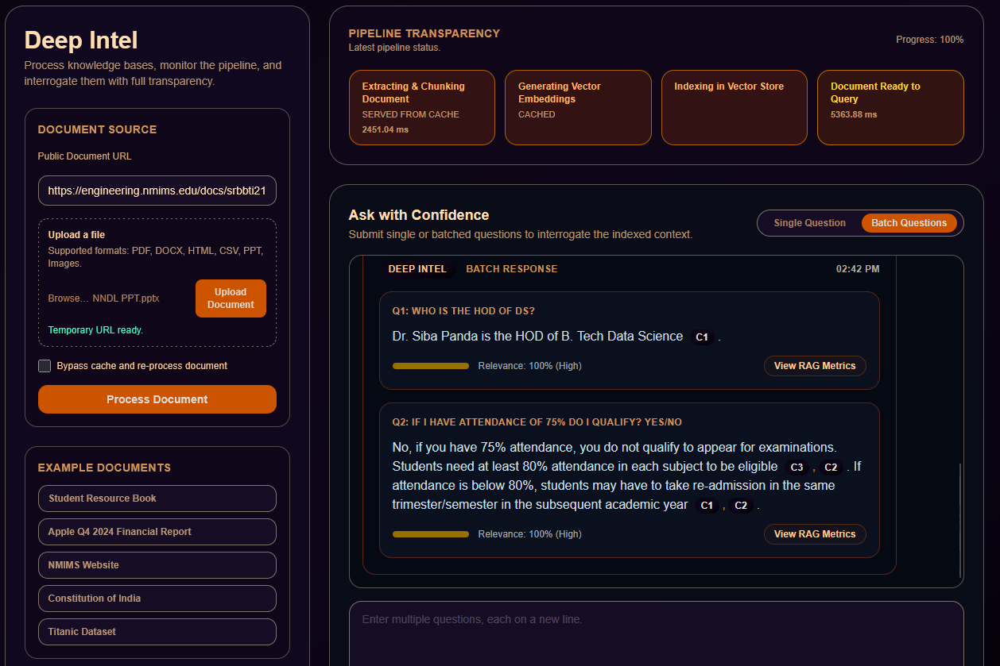

# HackRX-6.0: Document-Powered AI Assistant (DeepIntel - Modified Frontend Version)

## Overview

Team Longg Shott's intelligent document processing system that transforms any document into an interactive Q&A assistant. Simply provide a document URL and ask questions - our AI will analyze the content and provide accurate, contextual answers.

## How It Works - The Architecture

Our system implements a sophisticated Retrieval-Augmented Generation (RAG) pipeline that combines multiple AI technologies:

# Demo


### Complete Processing Pipeline

1. **Smart Document Detection**
   - Automatically identifies document type from URL headers and extensions
   - Supports 8+ formats: PDF, DOCX, Excel, PowerPoint, Images, HTML, CSV, Email

2. **Intelligent Content Extraction**
   - **PDFs**: Uses PyMuPDF for precise text extraction
   - **Word Documents**: Preserves structure with python-docx
   - **Excel/CSV**: Maintains row context and relationships
   - **Images/PowerPoint**: Advanced OCR using Mistral AI vision models
   - **HTML**: Smart content filtering with BeautifulSoup
   - **Email**: Extracts meaningful content from EML/MSG files

3. **Smart Text Chunking**
   - Uses Mistral-7B-Instruct-v0.1 tokenizer for precise token counting
   - Recursive chunking with 96 token overlap to maintain context
   - Optimized chunk sizes of 412 tokens for embedding models

4. **Vector Embeddings Generation**
   - Powered by NVIDIA's nv-embedqa-mistral-7b-v2 model
   - Converts text chunks and questions into high-dimensional vectors
   - Batch processing with 50 items per batch for optimal performance

5. **High-Performance Search**
   - Redis Stack with vector database capabilities
   - Hybrid retrieval: Combines semantic similarity (KNN) + keyword matching (BM25)
   - Retrieves top 24 initial results for comprehensive coverage
   - Intelligent caching system for faster repeat queries

6. **Advanced Re-ranking**
   - NVIDIA nv-rerank-qa-mistral-4b:1 model fine-tunes search results
   - Narrows down to top 12 most relevant passages
   - Ensures most relevant context reaches the AI model

7. **Intelligent Answer Generation**
   - Primary: Google Gemini 2.5 Flash Lite model
   - Fallback: Google Gemini 2.0 Flash for complex queries
   - Built-in prompt injection protection and content sanitization
   - Temperature 0.01 for consistent, factual responses

### Advanced Features

- **Smart Caching**: Questions and embeddings are cached to avoid reprocessing
- **Concurrent Processing**: Async operations for handling multiple questions simultaneously
- **Error Resilience**: Graceful fallbacks and comprehensive error handling
- **Security**: Input sanitization and prompt injection protection
- **Performance Monitoring**: Detailed timing metrics and request logging

## Quick Start API

### Main Endpoint
```http
POST /api/v1/hackrx/run
Content-Type: application/json

{
    "documents": "https://example.com/document.pdf",
    "questions": [
        "What is the main objective?", 
        "List the key steps.",
        "What are the requirements?"
    ],
    "force_refresh": false
}
```

### Response Format
```json
{
    "answers": [
        "The main objective is to develop...",
        "The key steps include: 1. Planning...",
        "Requirements include Python 3.12..."
    ]
}
```

### Key Parameters
- **documents**: Public URL to any supported document format
- **questions**: Array of questions to ask about the document
- **force_refresh**: Set to true to bypass cache and reprocess document

## Supported Document Formats

| Format | Technology | Use Cases |
|--------|------------|-----------|
| **PDF** | PyMuPDF | Research papers, reports, manuals |
| **DOCX** | python-docx | Contracts, proposals, documentation |
| **Excel/CSV** | openpyxl, pandas | Data analysis, financial reports |
| **PowerPoint** | LibreOffice + OCR | Presentations, slides |
| **Images (JPG/PNG)** | Mistral OCR | Screenshots, scanned documents |
| **HTML** | BeautifulSoup | Web pages, online articles |
| **Email (EML/MSG)** | email library | Email threads, communications |

### Architecture Components

**Core Technologies:**
- FastAPI: High-performance async web framework
- Redis Stack: Vector database with search capabilities
- NVIDIA AI APIs: Embeddings and re-ranking models
- Google Gemini: Natural language generation
- Mistral AI: OCR for images and presentations

**Processing Pipeline:**
1. Document type detection and download
2. Content extraction with format-specific parsers
3. Text chunking with context preservation
4. Vector embedding generation (NVIDIA)
5. Storage in Redis vector database
6. Hybrid search (semantic + keyword)
7. Result re-ranking (NVIDIA)
8. Answer generation (Google Gemini)

**Data Flow:**
```
Document URL → Content Extraction → Text Chunking → Vector Embeddings → 
Redis Storage → Question Processing → Hybrid Search → Re-ranking → 
Answer Generation → Response Caching → Final Response
```

## Technical Implementation Details

### Document Processing (src/document_processor.py)
- **identify_document_type()**: Uses HTTP headers and URL extensions to detect document format
- **download_document()**: Fetches documents with proper error handling and timeouts
- **parse_document_content()**: Format-specific extraction with OCR support for images/presentations
- **chunk_sections()**: Uses LangChain's RecursiveCharacterTextSplitter with Mistral tokenizer

### Vector Search & Caching (src/redis_client.py)
- **Redis Stack Integration**: Vector database with RedisVL for efficient similarity search
- **Hybrid Search**: Combines vector similarity (IP distance) with BM25 text matching
- **Smart Caching**: Embeddings and Q&A pairs cached with configurable TTL
- **Normalized Vectors**: Unit-length normalization for consistent similarity scoring

### API Orchestration (src/main.py)
- **FastAPI Framework**: Async request handling with comprehensive error management
- **Multi-Model Pipeline**: Coordinates embeddings, search, re-ranking, and generation
- **Performance Monitoring**: Request logging with detailed timing and metrics
- **Security**: Input sanitization and prompt injection protection

### Key Optimizations
- **Batch Processing**: Embeddings generated in configurable batches (50 items)
- **Connection Pooling**: Efficient Redis and API client management
- **Async Operations**: Non-blocking I/O for concurrent question processing
- **Intelligent Fallbacks**: Alternative models when primary responses are restricted

## Run with Docker Compose

Prerequisites:
- Docker and Docker Compose

Steps (Bash):
```bash
cp .env.example .env
# Edit .env to add your API keys
docker compose up --build -d
```

The API will be available at http://localhost:8000

### Performance Metrics

The system logs detailed performance data to `requests.log`:
- Document processing time
- Embedding generation time  
- Redis storage/retrieval time
- Answer generation time
- Cache hit/miss ratios
- Question processing metrics